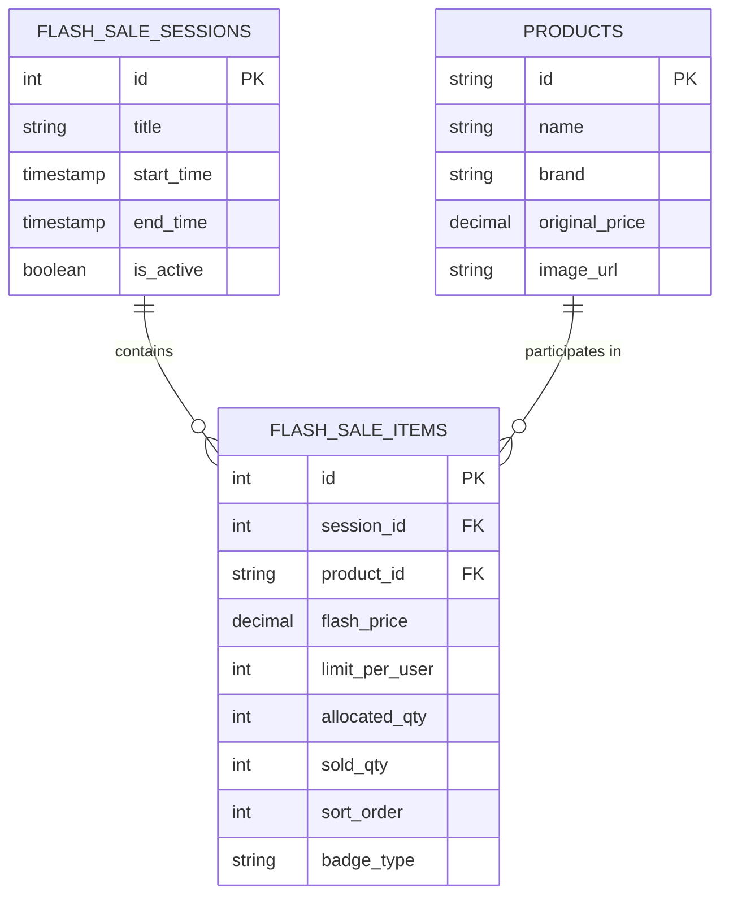
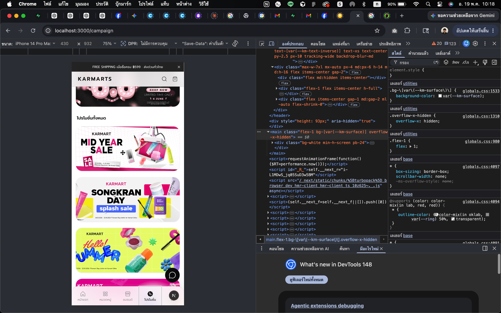

# คู่มือการออกแบบระบบหลังบ้าน (Backend Specification) สำหรับระบบ Flash Sale

เอกสารฉบับนี้จัดทำขึ้นเพื่อให้ทีมพัฒนาฝั่ง **Backend (`karmarts-api`)** และ **Back Office (`karmarts-bof`)** เข้าใจรูปแบบข้อมูล (Data Schema), หน้าที่ของ API, และกฎเกณฑ์ทางธุรกิจ (Business Rules) ที่ระบบหน้าบ้าน (Storefront) ได้ออกแบบไว้ เพื่อร่วมกันพัฒนาฟังก์ชัน Flash Sale ให้สมบูรณ์แบบ ทนทานต่อการกดซื้อจำนวนมาก (High Concurrency) และแสดงผลได้อย่างราบรื่น

---

## 1. โครงสร้างฐานข้อมูล (Database Schema)

เพื่อความยืดหยุ่น ควรแยกโครงสร้างออกเป็น 2 ตารางหลัก คือ **ตารางรอบเวลาจัดกิจกรรม (Flash Sale Sessions)** และ **ตารางสินค้าเข้าร่วมกิจกรรม (Flash Sale Items)**

### 1.1 ตารางรอบกิจกรรม: `flash_sale_sessions`
ตารางนี้ใช้ควบคุมช่วงเวลาการเปิด-ปิดกิจกรรม Flash Sale ในแต่ละวัน/สัปดาห์

| Field Name | Data Type | Constraints | Description |
| :--- | :--- | :--- | :--- |
| `id` | UUID / INT | Primary Key | ไอดีรอบกิจกรรม |
| `title` | VARCHAR(255) | NOT NULL | ชื่อรอบกิจกรรม (เช่น เที่ยงคืนวันเบิ้ล, Afternoon Rush) |
| `start_time` | TIMESTAMP WITH TZ | NOT NULL | วันเวลาที่เริ่มต้นกิจกรรม (เช่น `2026-05-19 00:00:00+07`) |
| `end_time` | TIMESTAMP WITH TZ | NOT NULL | วันเวลาที่สิ้นสุดกิจกรรม (เช่น `2026-05-19 23:59:00+07`) |
| `is_active` | BOOLEAN | DEFAULT TRUE | Status ของการเปิด/ปิดใช้งานรอบนี้โดยผู้ดูแลระบบ |
| `created_at` | TIMESTAMP | DEFAULT NOW() | วันที่สร้างข้อมูล |
| `updated_at` | TIMESTAMP | DEFAULT NOW() | วันที่อัปเดตข้อมูล |

### 1.2 ตารางรายการสินค้าเข้าร่วมกิจกรรม: `flash_sale_items`
ตารางนี้ผูกสินค้าเข้ากับรอบกิจกรรม และกำหนดการลดราคา รวมถึงจำนวนสต็อกโควตาพิเศษ

| Field Name | Data Type | Constraints | Description |
| :--- | :--- | :--- | :--- |
| `id` | UUID / INT | Primary Key | ไอดีรายการสินค้า Flash Sale |
| `session_id` | UUID / INT | Foreign Key | เชื่อมไปยัง `flash_sale_sessions.id` |
| `product_id` | VARCHAR(50) | FK to Products | ไอดีสินค้าหลักในระบบ |
| `flash_price` | DECIMAL(10,2) | NOT NULL | ราคาขายพิเศษช่วง Flash Sale (ทศนิยม 2 ตำแหน่ง) |
| `limit_per_user`| INT | DEFAULT 1 | จำกัดจำนวนชิ้นสูงสุดที่ลูกค้า 1 คนจะซื้อได้ในรอบนี้ |
| `allocated_qty` | INT | NOT NULL | จำนวนสต็อกโควตาที่จัดสรรมาขายในรอบนี้ (เช่น 500 ชิ้น) |
| `sold_qty` | INT | DEFAULT 0 | จำนวนชิ้นที่ขายออกไปแล้ว (ต้องมีกระบวนการ Lock สต็อกที่ปลอดภัย) |
| `sort_order` | INT | DEFAULT 0 | ลำดับการแสดงผลในหน้าเว็บ |
| `badge_type` | VARCHAR(20) | NULL | ป้ายกำกับเสริม (เช่น `hot`, `sale`, `best`, `new`) |

---

## 2. แผนภาพความสัมพันธ์ข้อมูล (ER Diagram)



---

## 3. บริการจัดส่งข้อมูลผ่าน API (API Endpoints)

### 3.1 [GET] `/api/v1/flash-sales/active`
ใช้ดึงรอบกิจกรรม Flash Sale ที่ **กำลังดำเนินการอยู่ในปัจจุบัน** หรือ **กำลังจะมาถึงในเร็วๆ นี้** พร้อมรายการสินค้าเพื่อนำไปแสดงผลบนหน้าแรกและหน้าแคมเปญ

#### Response JSON Payload Example:
```json
{
  "success": true,
  "data": {
    "session": {
      "id": 101,
      "title": "Flash Sale — ลดกระหน่ำจำกัดเวลา",
      "startTime": "2026-05-19T00:00:00+07:00",
      "endTime": "2026-05-19T23:59:00+07:00",
      "serverTime": "2026-05-19T10:10:53+07:00"
    },
    "products": [
      {
        "id": "1",
        "name": "Moisture Surge 100H Hydrator",
        "brand": "Clinique",
        "price": 990.00,
        "originalPrice": 1890.00,
        "image": "/product/image-clinique.png",
        "sold": 320,
        "total": 500,
        "endsAt": "2026-05-19T23:59:00+07:00",
        "badge": "hot",
        "limitPerUser": 2
      },
      {
        "id": "10",
        "name": "Vitamin C Brightening Essence",
        "brand": "Boya",
        "price": 490.00,
        "originalPrice": 990.00,
        "image": "/product/image-boya.png",
        "sold": 180,
        "total": 200,
        "endsAt": "2026-05-19T23:59:00+07:00",
        "badge": "sale",
        "limitPerUser": 1
      }
    ]
  }
}
```

> [!NOTE]
> ฟิลด์ `serverTime` สำคัญมากสำหรับการทำนาฬิกานับถอยหลัง (Countdown Timer) ฝั่งหน้าบ้าน เพื่อป้องกันปัญหาผู้ใช้งานตั้งเวลาบนโทรศัพท์มือถือไม่ตรงกับเซิร์ฟเวอร์

---

## 4. กฎเกณฑ์ทางธุรกิจที่หลังบ้านต้องควบคุม (Business Rules & Validations)

การทำ Flash Sale จะมีทราฟฟิกเข้ามาซื้อพร้อมกันจำนวนมาก (High Concurrency) ดังนั้น ระบบหลังบ้านจะต้องป้องกันความผิดพลาดด้วยกฎเหล็กดังนี้:

### 4.1 การตรวจสอบราคาและสต็อก ณ ขั้นตอนการชำระเงิน (Checkout & Place Order Validation)
เมื่อลูกค้ากด "ชำระเงิน" ระบบหลังบ้านต้องตรวจสอบ 4 ขั้นตอนแบบทันทีก่อนบันทึกคำสั่งซื้อ:
1. **Time Check:** เวลาปัจจุบันต้องอยู่ระหว่าง `start_time` ถึง `end_time` ของรอบกิจกรรมนั้นจริงๆ
2. **Quota Check:** จำนวนสินค้าที่เหลืออยู่ (`allocated_qty - sold_qty`) ต้องมีมากกว่าหรือเท่ากับจำนวนที่สั่งซื้อ
3. **Limit Per User Check:** ตรวจสอบประวัติคำสั่งซื้อของ User ID นั้นๆ ว่าในรอบกิจกรรมนี้เคยซื้อสินค้านี้ไปแล้วกี่ชิ้น หากรวมกับออเดอร์ใหม่แล้วเกินค่า `limit_per_user` ให้ปฏิเสธการสั่งซื้อ
4. **Price Check:** ต้องดึงราคาขายจริงจากตาราง `flash_sale_items.flash_price` ไปคำนวณยอดเงินรวม ห้ามเชื่อถือราคาที่ส่งมาจาก Client โดยตรงเด็ดขาด!

### 4.2 การจองสต็อกแบบ Transactional (Stock Reservation)
เพื่อแก้ปัญหาสินค้าขายเกินจำนวนจริง (Overselling) ห้ามใช้วิธีดึงสต็อกออกไปคำนวณนอกฐานข้อมูลแล้วอัปเดตกลับเข้ามา แต่ต้องลดจำนวนสต็อกและเช็คเงื่อนไขภายในคำสั่งเดียว (Atomic Operation):

#### ตัวอย่าง SQL สำหรับตัดสต็อกอย่างปลอดภัย (Optimistic Locking / Check constraint):
```sql
UPDATE flash_sale_items
SET sold_qty = sold_qty + :purchase_qty
WHERE id = :item_id
  AND (allocated_qty - sold_qty) >= :purchase_qty;
```
*(หากจำนวนแถวที่อัปเดตสำเร็จคือ 1 แถว แปลว่าจองสต็อกสำเร็จ หากคืนค่า 0 แปลว่าสินค้าหมดแล้ว)*

#### ตัวอย่างการใช้ Redis (หากทราฟฟิกสูงมาก):
ให้ทำการ Cache จำนวนสต็อกที่เหลือไว้บน Redis โดยใช้คำสั่งแบบ Atomic เช่น `DECRBY flash_sale_stock:item_id quantity` หากค่าที่ได้ติดลบ ให้รีบคืนสต็อกกลับไปด้วยคำสั่ง `INCRBY` และแจ้งเตือนลูกค้าว่าสินค้าหมดทันที

### 4.3 การคืนสต็อก (Stock Release)
หากคำสั่งซื้อที่กดจอง Flash Sale ไว้:
* ถูกยกเลิกโดยผู้ใช้
* ชำระเงินไม่สำเร็จภายในเวลาที่กำหนด (เช่น ภายใน 15 นาที สำหรับพร้อมเพย์)
* ระบบตัดบัตรเครดิตล้มเหลว
**ระบบหลังบ้านต้องมี Batch Job หรือ Webhook เพื่อมาดึงจำนวนสต็อก `sold_qty` กลับคืนมา (`sold_qty = sold_qty - qty`) ทันที** เพื่อปล่อยให้ลูกค้ารายอื่นกดซื้อต่อได้

---

## 5. การจัดการหลังบ้าน (Back Office Features - `karmarts-bof`)

หน้าแอดมินจะต้องสามารถจัดการข้อมูลเหล่านี้ได้:
1. **หน้าสร้างรอบกิจกรรม (Session Creator):** ตั้งชื่อและเลือกช่วงวันที่เริ่ม-จบของกิจกรรม
2. **หน้าเลือกสินค้าเข้าร่วม (Product Picker):** ค้นหาสินค้าจากคลัง นำมาใส่ราคา Flash Sale, กำหนดสต็อกแบ่งขาย และกำหนดจำกัดชิ้นต่อคน
3. **แดชบอร์ดติดตามความคืบหน้า (Real-time Progress Bar):** โชว์สถิติเป็นเปอร์เซ็นต์แบบ Real-time ว่าแต่ละชิ้นขายไปได้แล้วเท่าไร เพื่อให้ทีมการตลาดบริหารจัดการโปรโมชันได้อย่างรวดเร็ว

---
*(จัดเตรียมขึ้นเพื่อส่งต่อให้กับทีมระบบหลังบ้าน / Backend Developer สำหรับสร้าง API และโครงสร้างข้อมูลสนับสนุนหน้าเว็บ)*
