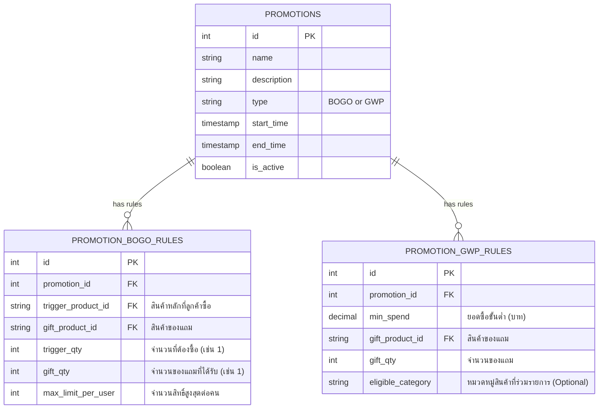
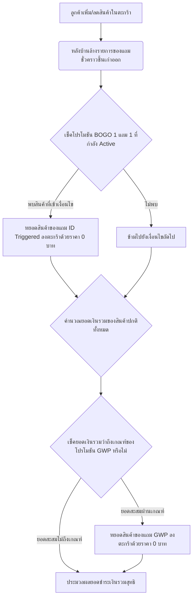

# คู่มือการออกแบบระบบหลังบ้าน (Backend Specification) สำหรับระบบ Promotion Engine

เอกสารฉบับนี้จัดทำขึ้นเพื่อให้ทีมพัฒนาฝั่ง **Backend (`karmarts-api`)** และ **Back Office (`karmarts-bof`)** ร่วมกันพัฒนาและออกแบบระบบ **Promotion Engine** เพื่อรองรับโปรโมชัน 2 รูปแบบหลักที่มีความยืดหยุ่นสูง เลือกสินค้าจากหลังบ้านได้ และทำงานร่วมกับตะกร้าสินค้า (Cart & Checkout) ได้อย่างสมบูรณ์แบบ:

1. **โปรโมชัน 1 แถม 1 (Buy 1 Get 1 Free - BOGO):** ซื้อสินค้าชิ้นที่กำหนด จะได้รับสินค้าแถมฟรีโดยอัตโนมัติ (สามารถเลือกได้ว่าแถมชิ้นเดียวกัน หรือแถมสินค้าอื่นที่จัดเตรียมไว้)
2. **โปรโมชันช้อปครบรับของแถม (Gift With Purchase - GWP):** เมื่อมียอดซื้อสินค้าที่กำหนดครบ $X$ บาท จะได้รับของแถมพิเศษฟรีทันที

---

## 1. โครงสร้างฐานข้อมูล (Database Schema)

เพื่อรองรับโปรโมชันทั้งสองรูปแบบและสามารถจัดเก็บเงื่อนไขที่ซับซ้อนได้ ควรใช้โครงสร้างแบบ Table-Inheritance หรือแยกตารางตามรูปแบบโปรโมชัน ดังนี้



### 1.1 ตารางหลักโปรโมชัน: `promotions`
ใช้จัดเก็บรายละเอียดทั่วไป ช่วงเวลาแคมเปญ และประเภทโปรโมชัน

| Field Name | Data Type | Constraints | Description |
| :--- | :--- | :--- | :--- |
| `id` | INT / UUID | Primary Key | ไอดีโปรโมชัน |
| `name` | VARCHAR(255) | NOT NULL | ชื่อโปรโมชัน (เช่น "1 แถม 1 Cathy Doll ชิ้นพิเศษ") |
| `description` | TEXT | NULL | คำอธิบายสั้นๆ สำหรับแสดงหน้าเว็บ |
| `type` | VARCHAR(50) | NOT NULL | ประเภทโปรโมชัน (`BOGO` หรือ `GWP`) |
| `start_time` | TIMESTAMP WITH TZ | NOT NULL | วันเวลาที่เริ่มจัดโปรโมชัน |
| `end_time` | TIMESTAMP WITH TZ | NOT NULL | วันเวลาที่สิ้นสุดโปรโมชัน |
| `is_active` | BOOLEAN | DEFAULT TRUE | สถานะเปิด/ปิดโปรโมชัน |

### 1.2 ตารางกฎ 1 แถม 1: `promotion_bogo_rules`
ตารางสำหรับกำหนดรูปแบบการซื้อ $A$ แถม $B$ โดยของแถมสามารถกำหนดผ่านหลังบ้านเป็นชิ้นใดก็ได้

| Field Name | Data Type | Constraints | Description |
| :--- | :--- | :--- | :--- |
| `id` | INT / UUID | Primary Key | ไอดีของกฎ BOGO |
| `promotion_id` | INT | Foreign Key | เชื่อมโยงไปยัง `promotions.id` |
| `trigger_product_id`| VARCHAR(50) | FK to Products | สินค้าที่ต้องซื้อเพื่อเปิดใช้งานโปรโมชัน (สินค้าหลัก) |
| `gift_product_id` | VARCHAR(50) | FK to Products | สินค้าที่จะมอบให้เป็นของแถม (สามารถเป็น ID เดียวกับสินค้าหลัก หรือสินค้าอื่นก็ได้) |
| `trigger_qty` | INT | DEFAULT 1 | จำนวนสินค้าหลักที่ต้องซื้อ (เช่น ซื้อ 1 หรือ ซื้อ 2) |
| `gift_qty` | INT | DEFAULT 1 | จำนวนของแถมที่จะได้รับ (เช่น แถม 1) |
| `max_limit_per_user`| INT | NULL | สิทธิ์สูงสุดที่บัญชีผู้ใช้ซื้อได้ต่อกิจกรรมนี้ (กันกว้านซื้อ) |

### 1.3 ตารางกฎซื้อครบรับของแถม: `promotion_gwp_rules`
ตารางกำหนดขั้นบันไดของยอดเงินรวมในตะกร้าสินค้าเพื่อแจกของแถมตามเงื่อนไข

| Field Name | Data Type | Constraints | Description |
| :--- | :--- | :--- | :--- |
| `id` | INT / UUID | Primary Key | ไอดีของกฎ GWP |
| `promotion_id` | INT | Foreign Key | เชื่อมโยงไปยัง `promotions.id` |
| `min_spend` | DECIMAL(10,2) | NOT NULL | ยอดช้อปสะสมในตะกร้าที่กำหนด (เช่น `1500.00` บาท) |
| `gift_product_id` | VARCHAR(50) | FK to Products | สินค้าแถมสุดพิเศษที่จะได้รับ |
| `gift_qty` | INT | DEFAULT 1 | จำนวนชิ้นของแถมที่ให้ต่อออเดอร์ |
| `eligible_category`| VARCHAR(100) | NULL | หมวดหมู่สินค้าที่ร่วมรายการ (หากเว้นว่างไว้ จะคิดจากยอดรวมสินค้าทุกชนิดในตะกร้า) |

---

## 2. ขั้นตอนการคำนวณและประมวลผลตะกร้าสินค้า (Cart & Checkout Engine)

หัวใจสำคัญของโปรโมชันหลังบ้านคือ **การคำนวณและหยอดของแถมลงในตะกร้าโดยอัตโนมัติ (Dynamic Cart Calculation)** ทุกครั้งที่สินค้าในตะกร้าเปลี่ยนแปลง ระบบหลังบ้านต้องคำนวณโปรโมชันและจัดการโครงสร้างตะกร้าสินค้าใหม่ตามลอจิกดังนี้:



### 2.1 รายละเอียดการประมวลผล 1 แถม 1 (BOGO Application Logic)
1. หลังบ้านตรวจสอบสินค้าหลักในตะกร้าของลูกค้า
2. หากพบสินค้าหลักที่มี `id` ตรงกับตาราง `promotion_bogo_rules` และมีจำนวนสินค้าถึงเป้า `trigger_qty`
3. ระบบจะทำการคำนวณจำนวนของแถมที่ได้รับ `gift_qty * (quantity / trigger_qty)`
4. **หยอด (Inject) สินค้าที่มี `gift_product_id` ลงไปในรายการสินค้าในตะกร้าทันที โดยระบุ `price = 0` และมีป้ายกำกับบอกว่าเป็นไอเทมแถมฟรีจากโปรโมชันชิ้นใด**
5. หากลูกค้ากดลดจำนวนสินค้าหลักลงต่ำกว่าเกณฑ์ ระบบจะดึงของแถมออกโดยอัตโนมัติ

### 2.2 รายละเอียดการประมวลผลช้อปครบรับของแถม (GWP Application Logic)
1. หลังบ้านคำนวณยอดเงินรวมของสินค้าปกติ (Subtotal) ที่ไม่ใช่สินค้าของแถม
2. ตรวจสอบเงื่อนไขกับตาราง `promotion_gwp_rules` ที่กำลังเปิดใช้งานในปัจจุบัน
3. หากยอดเงินรวมผ่านเกณฑ์ `min_spend` ที่กำหนดสูงสุด (หากมีหลายขั้นบันได ให้ยึดเกณฑ์ขั้นที่สูงที่สุดที่ผ่านเงื่อนไข)
4. **หยอด (Inject) สินค้าของแถม `gift_product_id` ด้วย `price = 0` ลงไปในรายการสินค้าในตะกร้าอัตโนมัติ**
5. หากยอดเงินรวมลดลงต่ำกว่าเกณฑ์ภายหลัง (เช่น ลูกค้าลบสินค้าออก หรือเปลี่ยนใจ) ให้ดึงสินค้าของแถมออกโดยอัตโนมัติ

---

## 3. บริการผ่าน API (API Endpoints)

### 3.1 [POST] `/api/v1/cart/calculate`
ใช้สำหรับตรวจสอบ ตะกร้าสินค้า และคำนวณราคา โปรโมชัน พร้อมของแถมอัตโนมัติ ทุกครั้งที่มีการเปลี่ยนจำนวนสินค้าในตะกร้า

#### Request Body Payload:
```json
{
  "items": [
    {
      "productId": "1",
      "quantity": 1
    },
    {
      "productId": "2",
      "quantity": 1
    }
  ]
}
```

#### Response Body Payload (แสดงผลลัพธ์ของแถมที่หยอดลงไปอัตโนมัติ):
```json
{
  "success": true,
  "data": {
    "subtotal": 3880.00,
    "discount": 0.00,
    "total": 3880.00,
    "items": [
      {
        "productId": "1",
        "name": "Moisture Surge 100H Hydrator",
        "price": 990.00,
        "quantity": 1,
        "isGift": false
      },
      {
        "productId": "2",
        "name": "Advanced Génifique Youth Serum (เข้าร่วมโปร 1 แถม 1)",
        "price": 2890.00,
        "quantity": 1,
        "isGift": false
      },
      {
        "productId": "gift-bogo-serum",
        "name": "[ของแถมฟรี] Advanced Génifique Youth Serum",
        "price": 0.00,
        "quantity": 1,
        "isGift": true,
        "giftFromPromotion": "BOGO-102"
      },
      {
        "productId": "gift-premium-bag",
        "name": "[ของแถมฟรีเมื่อช้อปครบ 2,500 บาท] กระเป๋าพรีเมียม Karmarts",
        "price": 0.00,
        "quantity": 1,
        "isGift": true,
        "giftFromPromotion": "GWP-305"
      }
    ]
  }
}
```

---

## 4. กฎเกณฑ์สำคัญเรื่องการซ้อนทับกันของสิทธิ์ (Promotion Stackability)

เพื่อรักษาผลประโยชน์และควบคุมงบประมาณค่าโปรโมชันของบริษัท ทีมหลังบ้านควรออกแบบสิทธิ์การซ้อนทับโปรโมชันดังนี้:

* **BOGO & GWP Stackability:** สามารถได้รับร่วมกันได้ (เช่น ซื้อตัว 1 แถม 1 แล้วทำให้ยอดรวมตะกร้าเกิน 2,500 บาท ลูกค้าจะได้รับทั้งของแถม BOGO และกระเป๋าแถม GWP ร่วมกันทันที)
* **GWP Tier Exclusivity:** หากระบบมีโปรโมชันช้อปครบแถมสินค้าหลายระดับ เช่น
  - ช้อปครบ 1,500 บาท รับเซ็ตแซมเพิลฟรี (Tier 1)
  - ช้อปครบ 2,500 บาท รับกระเป๋าแถมฟรี (Tier 2)
  **ลูกค้าควรจะได้รับเฉพาะสินค้าแถมระดับสูงสุดที่ผ่านเงื่อนไขเพียงชิ้นเดียวเท่านั้น (รับเฉพาะกระเป๋าแถม)** เพื่อลดปริมาณการแถมสินค้าซ้ำซ้อน เว้นแต่นโยบายการตลาดของแคมเปญนั้นจะระบุให้แถมทบซ้อนได้

---

## 5. การจัดการหลังบ้าน (Back Office Features - `karmarts-bof`)

ระบบจัดการข้อมูลสำหรับแอดมินหลังบ้านในการจัดการแคมเปญโปรโมชัน:
1. **หน้าลงทะเบียนโปร 1 แถม 1:** สามารถระบุสินค้า Trigger และสามารถเลือกสินค้าของแถมจากฐานข้อมูล พร้อมจำนวนและกำหนดช่วงเวลาโปรโมชันได้
2. **หน้ากำหนดขั้นบันไดของแถม (GWP Engine):** ตั้งค่ายอดซื้อขั้นต่ำ จับคู่สินค้าของแถม และกำหนดจำกัดสต็อกของแถมทั้งหมด เมื่อของแถมสต็อกหมด ระบบหลังบ้านต้องทำการหยุดหยอดของแถมชิ้นนั้นทันที และแอดมินสามารถเข้ามาเปลี่ยนสินค้าแถมชิ้นทดแทนได้สะดวก
