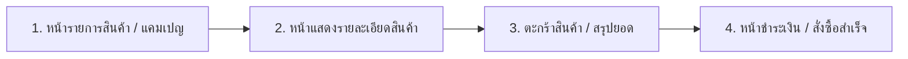

# บทวิเคราะห์การออกแบบประสบการณ์ผู้ใช้ (UX/UI Analysis) สำหรับระบบ Promotions (BOGO & GWP)

เอกสารฉบับนี้ทำการวิเคราะห์เชิงลึกเกี่ยวกับ **ประสบการณ์ผู้ใช้ (User Experience - UX)** และ **การออกแบบส่วนติดต่อประสานงานผู้ใช้ (User Interface - UI)** สำหรับระบบโปรโมชันทั้งสองรูปแบบ เพื่ออำนวยความสะดวกในการช้อปปิ้งของลูกค้า เพิ่มมูลค่าเฉลี่ยต่อคำสั่งซื้อ (AOV) และลดความสับสนในการซื้อสินค้าที่ร่วมรายการ

---

## 1. จุดทัชพอยต์ที่สำคัญในระบบ E-commerce (Core UX Touchpoints)

การสร้างแคมเปญโปรโมชันที่ดีจะต้องส่งข้อมูลเงื่อนไขถึงลูกค้าอย่างชัดเจน ตลอดเส้นทางการซื้อสินค้า (Customer Journey):

### 🔴 1.1 หน้ารายการสินค้า / แคมเปญ (Campaign & Listing Page)
* **ปัญหาดั้งเดิม:** ลูกค้าเห็นป้ายกำกับว่ามีโปรโมชันแถมฟรี แต่ไม่ทราบเงื่อนไขที่แท้จริงจนกว่าจะกดเข้าไปอ่านรายละเอียด ทำให้พลาดโอกาสช้อป
* **การออกแบบที่ดีกว่า:**
  1. **ป้ายกำกับกระชับบอกเงื่อนไขในตัว:** แทนที่จะใช้คำทั่วไป เช่น "ซื้อครบแถมฟรี" ให้เปลี่ยนมาบอกขีดจำกัด/เงื่อนไขทันที เช่น **`ครบ 500.- แถมฟรี`**
  2. **แบนเนอร์บอกเงื่อนไขระดับแคมเปญ:** การใช้รูปภาพแบบที่ระบุข้อความชัดเจน (อย่างรูป `buy500freeitem.png` ที่ระบุข้อความ *"ซื้อครบ 500.- รับฟรีของแถม"*) จะช่วยดึงดูดสายตาและทำให้ลูกค้าเข้าใจในเสี้ยววินาที

---

### 🟢 1.2 หน้าแสดงรายละเอียดสินค้า (Product Detail Page - PDP)
* **ปัญหาดั้งเดิม:** หน้ารายละเอียดสินค้าไม่ได้แสดงแถบบอกว่าสินค้านี้จะร่วมรายการแจกของแถมเมื่อช้อปถึงเท่าไหร่
* **การออกแบบที่ดีกว่า:**
  1. **Promotion Badge & Subtitle:** แสดงป้ายและรายละเอียดถัดจากราคาป้าย เช่น *"ร่วมรายการ ซื้อครบ 500.- รับฟรีของแถมพิเศษ"*
  2. **Free Gift Drawer/List:** แสดงรูปภาพขนาดเล็กของสินค้าแถม (Gift item preview) เพื่อเพิ่มคุณค่า (Perceived Value) ให้ลูกค้าอยากซื้อมากขึ้น

---

### 🔵 1.3 ตะกร้าสินค้า (Cart Drawer / Page) — *จุดเปลี่ยนสำคัญที่สุด!*
นี่คือโซนที่มีผลต่อการตัดสินใจซื้อมากที่สุด หากลูกค้าช้อปยังไม่ครบเงื่อนไข แต่เรากระตุ้นด้วยความคืบหน้า (Progress Bar) จะสามารถเพิ่มยอดสั่งซื้อได้ทันที

#### 1. แถบปรอทแจ้งความคืบหน้าโปรโมชัน (Dynamic Progress Bar)
ระบบจะทำการคำนวณยอดเงินสะสมปัจจุบัน และเปรียบเทียบกับเงื่อนไขสะสมครบ 500 บาท:

* **สถานะช้อปยังไม่ครบ (Subtotal < 500 บาท):**
  แสดงแถบสีเทา-สีเขียวมิ้นต์อ่อน พร้อมตัวหนังสือกระตุ้นความรู้สึกเสียดายของแถม เช่น:
  > 🎁 *ช้อปอีกเพียง **฿120** ก็จะได้รับของแถมพรีเมียมฟรี!*
* **สถานะช้อปครบสมบูรณ์ (Subtotal >= 500 บาท):**
  แถบจะวิ่งเต็ม 100% เป็นสีเขียวพาสเทลสว่างพร้อมไอคอนเครื่องหมายถูก และข้อความยินดี:
  > 🎉 *ยินดีด้วย! คุณช้อปครบ ฿500 และได้รับของแถมพรีเมียมเรียบร้อยแล้ว*

#### 2. การหยอดของแถมฟรี 0 บาทลงตะกร้าอัตโนมัติ (Auto-injected Free Gift)
* เมื่อช้อปถึง ฿500 ระบบต้องนำภาพสินค้าของแถมพรีเมียม (เช่น คลีนซิ่งบาล์ม หรือชุดแปรงแต่งหน้า) แสดงเพิ่มเข้ามาในรายการสินค้าในตะกร้าทันที
* **ของแถมนี้ต้องตั้งค่าให้อ่านได้อย่างเดียว (Read-Only):** ล็อคจำนวนให้เป็น 1 ชิ้น, ซ่อนปุ่มลบสินค้าออก, และซ่อน Checkbox เลือกสินค้า เพื่อแสดงให้ลูกค้าเห็นอย่างโปร่งใสว่านี่คือผลประโยชน์ที่ระบบมอบให้ฟรีจากการช้อปครบเกณฑ์

---

### 🟣 1.4 หน้าชำระเงินและหน้าคำสั่งซื้อสำเร็จ (Checkout & Thank You Page)
* **การออกแบบที่ดีกว่า:**
  * **Summary Breakdown:** รายการของแถมต้องปรากฏร่วมกับของปกติในการจัดส่ง โดยราคาต้องคงไว้ที่ ฿0 และแสดงตัวอักษรสีเขียว/แดงกำกับเด่นชัด
  * **Thank you page:** บันทึกข้อมูลของแถมลงฐานข้อมูลสั่งซื้อ เพื่อส่งข้อมูลสินค้าแถมเข้าระบบจัดส่งหลังบ้าน และส่งอีเมลยืนยันเพื่อลดข้อพิพาทของลูกค้า

---

## 2. แผนการดำเนินการพัฒนาหน้าตระกร้าสินค้า (Implementation Strategy)
เราจะสร้างประสบการณ์ตะกร้าสินค้าที่ยอดเยี่ยมนี้บนเว็บของคุณทันที โดยทำการแก้ไขไฟล์ `src/components/cart/CartClient.tsx`:
1. **เพิ่มค่าคงที่เป้าโปรโมชัน:** `PROMO_FREE_GIFT_THR = 500` และกำหนดไอเทมของแถมพิเศษ
2. **สร้าง UI ปรอมวัดระดับโปรโมชันซื้อครบ 500.-** ที่ทำงานแบบตอบสนองทันที (Dynamic Progress Bar) ตามยอดตะกร้า
3. **หยอดของแถมจำลอง (Mock Free Gift injection)** เข้าไปในรายการสินค้าเมื่อยอดสะสมครบ 500.- พร้อมล็อคฟังก์ชันแก้ไขเพื่อความเป็นระบบที่สมบูรณ์แบบ
